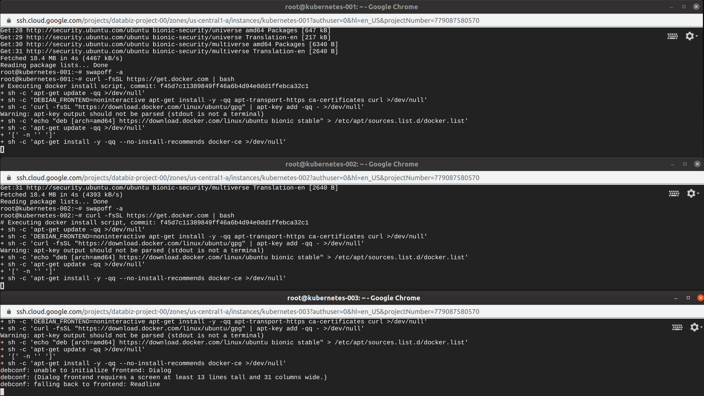
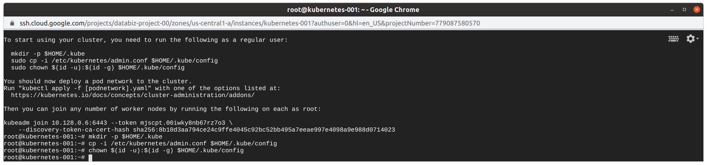
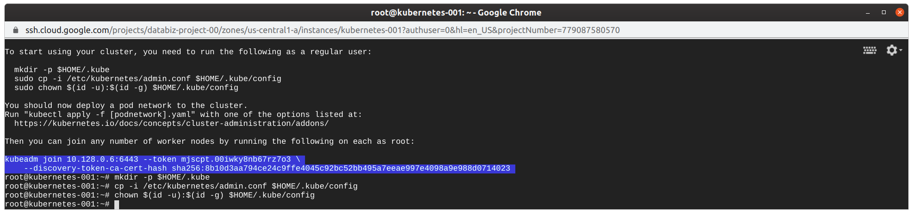
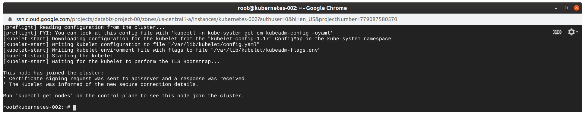
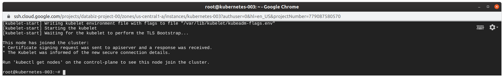
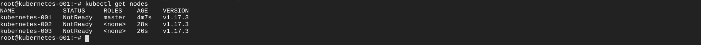
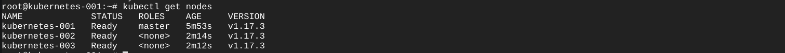
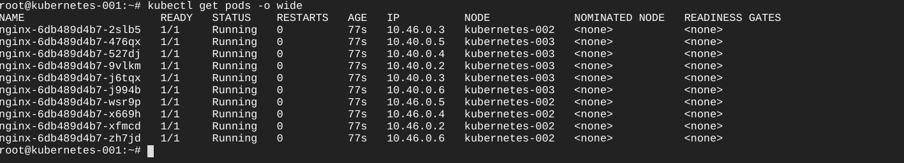

# Instalação do cluster kubernetes com 3 nós

**Itens Necessários**  
* Caso não tenha o Docker Instale ele.
* Necessário desligar a swap para poder fechar o cluster kubernetes.
* Ter 3 Maquinas virtuais ou 3 containers para poder gerenciar via Kubernetes (dica montar as maquinas num ambiente em cloud)  

## Etapas 

1. Instalar o Docker nas maquinas
```
curl -fsSL https://get.docker.com | bash
```


2. Desligar o Swap
```
swapoff -a
```
3. E comente a entrada referente a swap em seu arquivo fstab:
```
vim /etc/fstab
```
4. Adicionar o Kubernetes no repositorio do SO linux utilizado
```
apt-get update && apt-get install -y apt-transport-https

```

5. Instalar o Kubernetes

```
echo "deb http://apt.kubernetes.io/ kubernetes-xenial main" > /etc/apt/sources.list.d/kubernetes.list

apt-get update

apt-get install -y kubelet kubeadm kubectl
```
6. Instalação do kubelet, kubectl e kubeadm
```
apt-get install kubelet kubectl kubeadm -y
```

kubelet: Agente do kubernetes rodando nos nós, ele se comunica com o master.

kubectl: Opera o cluster.

kubeadm: Monta o nosso cluster.

## Iniciando o Cluster
Esse comando irá iniciar o cluster master
```
kubeadm init --apiserver-advertise-address $(hostname -i
```

Após usar ele, ele irá dar os comandos para poder montar os workers.  
Será algo do Tipo: 
Obs.: Os comandos devem ser primeiro adicionados no master e depois nos workers.  

```
To start using your cluster, you need to run the following as a regular user:

# mkdir -p $HOME/.kube

# sudo cp -i /etc/kubernetes/admin.conf $HOME/.kube/config

# sudo chown $(id -u):$(id -g) $HOME/.kube/config
```
Copie o comando ao fim do init nas maquinas onde estaram os workers para poder unir eles ao master.  



Note eles nos nodes:  

  

Use os comandos nas maquinas para poder subir os nós interligados ao cluster.  

Para ver eles no master digite *kubectl get nodes*  
  
Note que eles estaram desligados (not ready).  

Use o kubectl *apply -f* para poder iniciar os nodes
```
kubectl apply -f "https://cloud.weave.works/k8s/net?k8s-version=$(kubectl version | base64 | tr -d '\n')"
```



Vamos listar os pods em uso interno pelo kubernetes:
 
```
kubectl get pods -n kube-system
```


Para testarmos o uso podemos usar o seguinte comando: 

```
kubectl run nginx --image nginx --replicas 10
```
O comando acima irá criar 10 pods com a imagem do NGINX.  

Para visualizar os pods:  
```
kubectl get pods -o wide
```



## Referências

* [Descomplicando o Kubernetes 02](https://www.linuxtips.io/post/descomplicando-o-kubernetes-02)