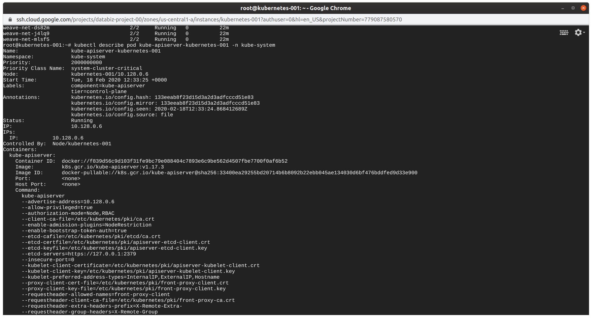

# Overview dos comandos básicos do kubernetes

## kubectl get nodes
verifica se todos os nodes do nosso cluster estão ok:

## source <(kubectl completion bash)
Permite usar o auto-complete: 

## kubectl describe node {nome do node}
Verifica os detalhes do node:

## kubectl get pods -n kube-system
Verifica os pods do namespace do kubernetes, o kube-system:

## kubectl  describe pod kube-apiserver-{nodenode} -n kube-system
Usando o describe para ver detalhes de algum pod:

## kubectl get pods -n kube-system -o wide
Verificando os pods do namespace do kubernetes, o kube-system e utilizando a opção -o wide:

## kubectl run meu-nginx --image nginx
Cria um deployment do nginx.

## kubectl get deployments
Verificando o deployment criado:

## kubectl describe deployment nginx
Verificando os detalhes de nosso deployment:

## kubectl get pod,deployments
Uso do get pod e o get deployment juntos:

## kubectl describe deployment nginx
Verificando os detalhes de nosso deployment.

## kubectl scale deployment nginx --replicas=10
Aumentando a quantidade de replicas de nosso deployment.  

## kubectl delete deployment meu-nginx
Removendo nosso deployment:

## kubectl get pods --all-namespaces
Verificando os pods de todos os namespaces:

## Referências 
* [Descomplicando o Kubernetes 03](https://www.linuxtips.io/post/descomplicando-o-kubernetes-03)

____
