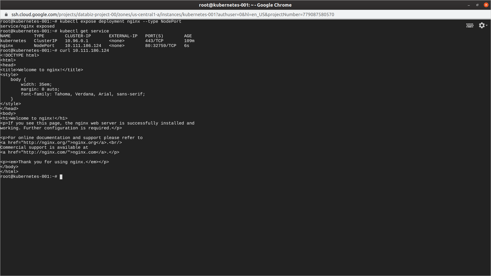

# Criação de serviços no Kubernetes

Para iniciar iremos criar um deployment:  
**kubectl run nginx --image nginx --port 80**  

Agora vamos visualizar o deployments:  
**kubectl get deployments**  

Vamos expor o cluster para a web, expondo o deployment:  
**kubectl expose deployment nginx**  

Verificando se foi criado o serviço (o tipo é ClusterIP):  
**kubectl get service**  

Pra ver os detalhes da conexão use o *curl ip*.

Verificando os detalhes do cluster:
**kubectl describe service nginx**

Note que no campo selector ha um label do nginx ele precisa dar mathc com o deployment.  

Para deletar o cluster:
**kubectl delete service nginx**  

--- 

## NodePort
Agora vamos subir o cluster novamente mas com um novo parametro:  
**kubectl expose deployment nginx --type NodePort**

Agora para ver:
**kubectl get service**

Para testar basta colocar o IP no browser, ou usar o curl.  

Vamos deletar este cluster:  
**kubectl delete service nginx**  

---
## LoadBalancer
Agora vamos subir o cluster novamente mas com um novo parametro:  
**kubectl expose deployment nginx --type LoadBalancer**

Vamos verificar os serviços
**kubectl get services**
Obs.: O loadBalancer cria clusterIP e nodeport e loadbalancer.  

Agora só deletar o cluster
**kubectl delete service nginx**  

---